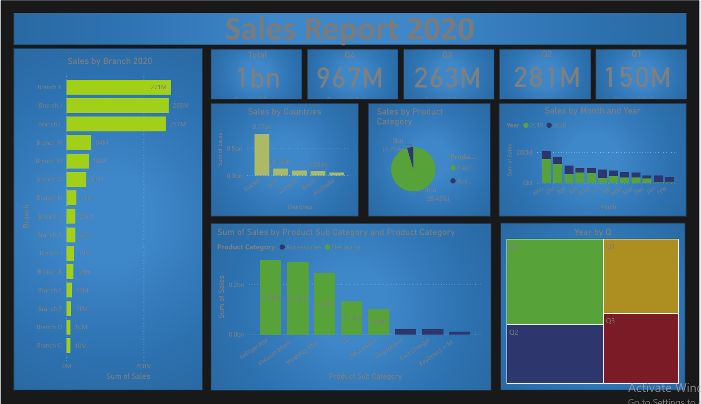

# 📊 Sales Report 2020 – Power BI Dashboard

## 📌 Overview
This dashboard provides a complete visual summary of **sales performance for the year 2020**, including breakdowns by branch, product category, sub-category, countries, and quarterly results.

The report helps decision-makers quickly identify top-performing branches, markets, and products.

---

## 🧮 Key Highlights
- **Total Annual Sales:** 1B+  
- **Q4 Sales:** 967M (Highest quarter)  
- **Q3 Sales:** 263M  
- **Q2 Sales:** 281M  
- **Q1 Sales:** 150M  

---

## 📈 Visual Insights Included
### 🏢 Sales by Branch 2020
- Branch K, Branch J, and Branch L lead with the highest annual sales.

### 🌍 Sales by Countries
Top markets include:
- **Russia (Highest)**
- USA  
- Canada  
- Brazil  
- Australia  

### 🛒 Sales by Product Category
- Electronics dominate the revenue share compared to Accessories.

### 📅 Sales by Month & Year
- Monthly trend comparison between **2019 & 2020**.

### 🧩 Sales by Product Sub-Category
Detailed insight into products such as:
- Refrigerator  
- Vacuum Machine  
- Washing Machine  
- TV  
- Microwave  
- Headphone  
- Fast Charger  

### 🟦 Year by Quarter (Tree Map)
- Visual comparison of Q1, Q2, Q3, and Q4 performance.

---

## 🖼 Dashboard Preview

> Make sure the image file name matches exactly: **Sales Report 2020.png**

---

## 🛠 Tools Used
- Power BI Desktop  
- Power Query  
- DAX Measures  
- Data Modeling  
- Advanced Visualizations  
- Trend Analysis  

---

## 📦 Files Included
- `Sales_Report_2020.pbix`  
- `Sales Report 2020.png`  
- Dataset files (if included)  
- `README.md`

---

## 🚀 Conclusion
This dashboard provides a full analytical view of the organization’s sales structure and trends during 2020, supporting:
- Strategic sales planning  
- Product performance evaluation  
- Branch performance comparison  
- Market opportunity analysis  
